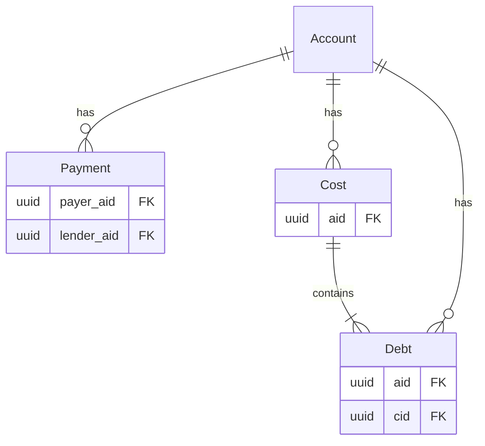

# Money Tracker Backend

**WIP** project to store costs and payments of accounts to figure out who has to pay what and how much money is spent at different places.

### data model
- Account: central thing to be linked to (e.g. a person who has costs and owes others)
- Cost: data of something that was already payed and needs to be payed back by others (e.g. shopping cost)
- Debt: shows the distribution for parts of costs (e.g. person A needs to pay 40% of cost A to person B)
- Payment: repayment of cost/debt between persons (e.g. payment of 10 Euro from person A to person B)

## production environment
Currently the service is running via `railway.app`, the database is hosted on `planetscale.com` and for authentication it uses `discord`.
- it exists a production and testing environment

### Variables
Generally there are a few things needed for production (and probably others) to run. These can be found in the `.env.example` file

## run entirely in docker
- run `docker compose up`
  - for: db (will run migration), adminer, backend (rust env)
- seeding script can be found in `./seeding/<FILES>`
- url and swagger url will be shown in the output

## run with local rust env
- copy `.env.example` to `.env`
  - and update/insert invalid/missing envs
- run `make setup`
  - starts db, adminer
  - runs migration (as it checks the local db instead)
- start server with `cargo run`
- (optional) run the seeding script to populate the db (while the service is running)
  - `./seeding/<FILES>`

### add new migration
- add migrations (up/down) with `cargo install sqlx-cli`
  - `sqlx migrate add -r <name>`
  - insert SQL in the up/down files
- updates of database needs to be regenerated
  - so that sqlx can be run in offline mode
  - `cargo sqlx prepare`
  - and commit the `sqlx-data.json`
